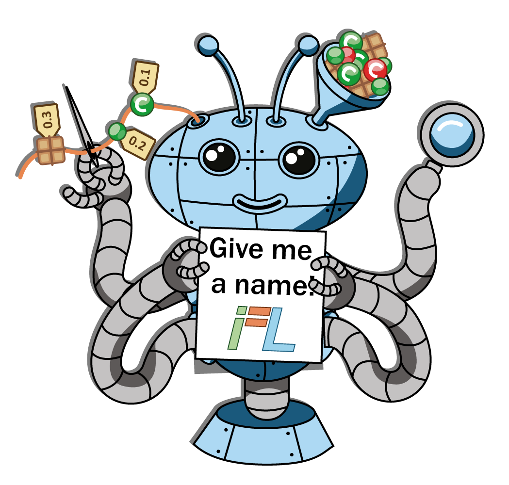

## Introduction

{% include left-img.html img="mascot/dev_with-hammer.png" img-width="30%"
content="He is a software engineer who creates various software systems for several different users. His daily workflow not only includes writing the code but also  ensuring that it is working correctly. To this end, he usually creates some unit tests to check the functionality of the code. If any of these tests fail, this means that there is an error either in the production or the test code." %}

{% include center-img.html img="mascot/bugs.png" img-width="30%"
content="And, here come the bugs which are the consequences of mistakes the programmer made. They prevent the software from accomplishing its tasks correctly. Bugs could be present all over the system, and sometimes they are difficult to spot and fix." %}

{% include left-img.html img="mascot/inspect.png" img-width="20%"
content="Developers usually have to check a number of code elements, like packages, classes, and methods, until they find the \"buggy\" ones. During this process, called fault localization, they use various debugging techniques and tools to speed up their work. For example, they manually inspect the related code chunks, or they modify it to make the error more prominent, hence easier to catch. There are various debugging tools which allow the examination of the states of the software during execution." %}

{% include center-img.html img="mascot/rank.png" img-width="30%"
content="In our research, we concentrate on automatic means to fault localization. In automated fault localization, we analyze the test results and compare them to the list of code elements (statements or methods, for instance) that are executed while running the tests. If a code element is executed by many failing tests and few passing ones, this is a good candidate to contain the bug. In reserach literature, this technique is known as Spectrum Based Fault Localization (or SBFL for short). In SBLF, each element is given a score which represents its suspiciousness of being faulty, and this information can be used by the developer during debugging." %}

{% include right-img.html img="mascot/dev_think_right.png" img-width="30%"
content="However, these automatic scoring algorithms and the underlying statistical formulas (and there are quite a few!) are not perfect. They may rank a code element very high in the suspiciousness while being innocent, or the opposite. On average, the algorithms can provide help, but sometimes they can mislead the user, and the programmer may have better knowledge of the piece of code investigated. For example, the developer can know that there are several parts of the code which are definitely correct such as the trivial `getter` and `setter` methods or classes he already checked, etc. At the same time, the programmer could be very suspcious about some other code parts based on his previous investigations. So, why not help each other? The programmer could tell the automated fault localization where to concentrate more, in order to be of better help next time in return." %}

{% include left-img.html img="mascot/alg_ranks_left.png" img-width="40%"
content="Our newly proposed methodology, called Interactive Fault Localization (iFL, for short), works exactly like this. The ranked list of suspicious code elements is a result of continuous discourse between the algorithm and the developer. Our idea is to let the user modify the score of the methods, classes, etc., by giving various feedback options about the suggested items. This way, both of them could concentrate on the task they excel in. The algorithm collects and analyzes test results and test-code coverage data, while the developer uses his expert knowledge about the system to clean up the list of suspicious items. Eventually, our goal is to continue improving the iFL methodology and its implementation to provide tools for the developers for finding bugs faster." %}

{% include center-img.html img="logo/logo.png" img-width="40%"
content="For more information about the technical details of iFL and the current state of the research, check out our publications available from this site." %}

## Name our Little Friends!

    

You could suggest a name for the developer and for the robot by filling this [anonymous form](https://forms.gle/eTGFVMDtrA6KprMT7).
